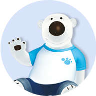

 
 

 

 <h1>
 <a href="http://main-project-client.s3-website.ap-northeast-2.amazonaws.com/" target="_blank" ># MoviePOP</a>
 </h1>

 

<b>맥주🍺 마시면서 같이 영화보자! “MoviePOP”</b> 
 프로젝트 기간: 2023.06.28 ~ 2023.07.27

 

# ❤️ Team List ❤️

|  |   |  |     |  |  |
| :------------------------------------: | :------------------------------------: | :-----------------------------------: | :-------------------------------------: | :----------------------------------: | :-----------------------------------: |
|   [정승현](https://github.com/plla2)   | [박영미](https://github.com/suemeeeee) | [장근실](https://github.com/sirigogo) | [오태호](https://github.com/OhTaeHo-97) | [권우혁](https://github.com/44Kwon)  | [송현우](https://github.com/song4529) |
|                FE 팀장                 |                   FE                   |                  FE                   |                BE 부팀장                |                  BE                  |                  BE                   |

 

# Stacks

 

# Service Manual

 
<h3>시작페이지</h3>

  
  - 이메일을 입력하면 해당 이메일을 회원가입으로 전송해서 편리하게 회원가입이 가능합니다.
- 로그인 버튼 클릭시 로그인 페이지로 이동합니다.
- 스크롤시 페이지가 아래, 위로 이동한다.

<h3>시연영상</h3>

 
<h3>회원가입 / 로그인</h3>

회원가입

- 이미지 넣는 인풋을 클릭하여 데스크탑의 이미지를 업로드할 수 있다.
- 시작페이지에서 이메일을 입력을 했을 시 입력한 이메일이 뜬다.
- 이메일, 비밀번호, 비밀번호 확인에 유효성을 통과하지 못하면 인풋 아래에 경고문이 뜬다.
- 인풋의 x 버튼을 통해 입력값을 삭제할 수 있다.
- 태그를 최소 1개, 최대 3개까지 선택하여 메인페이지의 추천게시글에 해당 태그들의 게시글이 뜨게된다.
- 연도. 월. 일. 을 클릭하여 달력에서 생년월일을 선택한다.

로그인

- 가입되어 있지 않는 이메일로 로그인 시도시 존재하지않는 유저 알림창이 뜬다.
- 가입되어 있는 이메일이지만 비밀번호가 틀리면 일치하지않는 비밀번호 알림창이 뜬다.
- 유효성에 대한 경고문은 회원가입 페이지와 똑같다.
<h3>시연영상</h3>

 
<h3>공통(헤더 / 푸터)</h3>

- 헤더
- 로고를 클릭하면 메인 페이지로 이동한다.
- 검색창에 검색어를 입력하면 검색어를 포함하는 영화와 관련된 리뷰 게시글이 나타난다.
- '#' 버튼을 클릭하면 태그들이 나타나고, 특정 태그를 클릭하면 해당 태그를 포함한 리뷰 게시글들이 나타난다.
- 리뷰작성 버튼을 클릭하면 리뷰 작성 페이지로 이동한다.
- 프로필 이미지를 클릭하면 MyPage 버튼과 Logout 버튼이 나타난다.
  - MyPage 버튼을 클릭하면 마이페이지로 이동한다.
  - Logout 버튼을 클릭하면 로그아웃을 진행한다.
- 푸터

  - github 로고, 노션 로고, 피그마 로고를 통해 각 로고에 맞는 해당 서비스의 사이트로 이동할 수 있다.
  <h3>시연영상</h3>

  

 
<h3>메인페이지</h3>

- 메인 페이지에는 유저 맞춤 추천 게시글, 인기 게시글, 전체 게시글이 나타난다.
- 각각의 게시글에는 썸네일, 게시글 제목, 작성 일자, 작성자 닉네임이 표시된다.
- 유저 맞춤 추천 게시글과 인기 게시글은 8개가 나타나고, 슬라이더를 이용하여 이동할 수 있으며 전체 게시글은 12개가 나타난다.
- 특정 게시글을 클릭하면 해당 게시글 상세 페이지로 이동한다.
- 더 보기 버튼을 클릭하면 전체 리뷰 게시글 페이지로 이동한다.

<h3>시연영상</h3>

 
<h3>전체 리뷰 게시글 페이지</h3>

- 전체 리뷰 게시글 페이지에는 모든 유저가 작성한 게시글들이 나타난다.
- 각각의 게시글에는 썸네일, 게시글 제목, 작성 일자, 작성자 닉네임이 표시된다.
- 무한 스크롤이 적용되어 스크롤을 내리면 새로운 게시글들이 나타난다.
- 특정 게시글을 클릭하면 해당 게시글 상세 페이지로 이동한다.
<h3>시연영상</h3>

 
<h3>리뷰작성페이지</h3>

- 썸네일, 게시글 제목, 영화 제목, 태그, 게시글 내용을 입력하고 등록하기 버튼을 클릭하면 해당 게시글이 등록된다.
  - 썸네일은 선택 사항이며, 태그는 최소 1개, 최대 3개까지 입력 가능하다.
  - 게시글 내용은 최소 10자, 최대 500자까지 입력 가능하다.
  <h3>시연영상</h3>

 
<h3>마이페이지</h3>

- 오른쪽 상단에 프로필 이미지를 클릭한 후, MyPage를 클릭하면 마이 페이지로 이동한다.
- 마이 페이지에는 개인정보(이름, 닉네임, 프로필 이미지, 이메일, 내가 선택한 태그), 활동 내역(찜한 게시글, 내가 쓴 게시글, 내가 모집중인 팟, 내가 참여중인 팟 정보)가 나타난다.
- 찜한 게시글
  - 찜한 게시글 중 하나를 클릭하면 해당 게시글 상세 페이지로 이동한다.
  - 찜한 게시글에 있는 가득 찬 팝콘 모양 버튼을 클릭하면 해당 게시글에 대한 찜이 취소되고 찜한 게시글 목록에서 사라진다.
- 내가 쓴 게시글
  - 내가 쓴 게시글 중 하나를 클릭하면 해당 게시글 상페 페이지로 이동한다.
  - 수정 버튼을 클릭하면 게시글 수정 페이지로 이동한다.
  - 삭제 버튼을 클릭하면 해당 게시글은 삭제된다. (새로고침을 진행하면 내가 쓴 게시글 목록에서 사라진다.)
- 내가 모집중인 팟
  - 내가 모집중인 팟 중 하나를 클릭하면 해당 팟의 정보를 나타내는 모달창이 나타난다.
  - 수정하기 버튼을 클릭하면 팟 정보를 수정할 수 있는 모달창이 나타난다.
  - 모집 삭제 버튼을 클릭하면 해당 팟 모집글은 삭제되고 내가 모집중인 팟 목록에서 사라진다.
- 내가 참여중인 팟
  - 내가 참여중인 팟 중 하나를 클릭하면 해당 팟의 정보를 나타내는 모달창이 나타난다.
  - 팟 참여 취소하기 버튼을 클릭하면 해당 팟의 참여가 취소되고 내가 참여중인 팟 목록에서 사라진다.
- 회원 탈퇴 버튼을 클릭하면 해당 회원은 서비스에서 탈퇴 처리되며 시작 페이지로 이동한다.
<h3>시연영상</h3>

 
<h3>게시글 상세페이지</h3>

- 특정 게시글을 클릭하면 게시글 상세 페이지로 이동한다.
- 게시글 상세 페이지에서는 게시글 제목, 영화 제목, 태그, 작성자 정보, 찜 개수, 작성 날짜, 게시글 내용, 썸네일, 팟 모집글 정보, 댓글 정보, 댓글별 좋아요 정보를 표시한다.
  - 팟 모집글 정보 : 팟 모집글 제목, 모임 일시, 장소, 모집 인원 현황, 참여자 일부 프로필 이미지
  - 댓글 정보 : 댓글 내용, 작성자 닉네임, 작성 날짜, 좋아요 개수
- (빈/가득 찬) 팝콘 모양 버튼을 클릭하면 해당 게시글에 대한 찜 (등록/해제)가 이루어지며 (가득 찬/빈) 팝콘 모양 버튼으로 변경되고 찜 개수가 (올라간다/내려간다).
- 댓글을 작성하고 등록 버튼을 누르면 댓글이 작성된다.
- 댓글에 있는 (빈/가득 찬) 팝콘 모양 버튼을 클릭하면 해당 댓글에 좋아요 (등록/해제)가 이루어지며 (가득 찬/빈) 팝콘 모양 버튼으로 변경되고 좋아요 개수가 (올라간다/내려간다).
- 등록하기 버튼을 클릭하면 팟 모집글을 등록할 수 있는 화면이 나타난다.
  - 팟 모집글 제목과 모집 일시, 장소와 모집 인원 및 소개글을 작성한 후 팟 모집하기 버튼을 클릭하면 팟 모집글이 등록된다.
  - 팟 모집글을 작성하면 작성자는 자동으로 해당 팟에 참여가 된다.
- 특정 팟 모집글을 클릭한 후, 모집 신청 버튼을 누르면 해당 팟에 참여할 수 있다.
<h3>시연영상</h3>

 
<h3>수정(내정보, 비밀번호, 게시글, 팟 모집글)</h3>

- 내 정보 수정
  - 회원 정보 수정 버튼을 클릭하여 회원 정보 수정 페이지로 이동한다.
  - 변경하고자 하는 프로필 이미지, 닉네임 및 태그를 작성한 후 회원정보 저장 버튼을 클릭한다.
  - 회원 정보 수정이 이루어지고 마이 페이지로 이동한다.
- 비밀번호 수정
  - 회원 정보 수정 페이지에서 비밀번호 수정 버튼을 클릭하여 비밀번호 수정 페이지로 이동한다.
  - 현재 비밀번호 및 변경할 비밀번호, 변경 비밀번호 확인을 입력한다.
  - 현재 비밀번호와 다르면 비밀번호가 일치하지 않는다는 오류 메시지를 띄우고 일치한다면 변경할 비밀번호로 비밀번호가 변경되고 마이 페이지로 이동한다.
- 게시글 수정
  - 썸네일, 게시글 제목, 영화 제목, 태그, 게시글 내용을 입력하고 수정하기 버튼을 클릭하면 해당 게시글이 수정된다.
    - 썸네일은 필수 사항이며, 태그는 최소 1개, 최대 3개까지 입력 가능하다.
    - 게시글 내용은 최소 10자, 최대 500자까지 입력 가능하다.
- 팟 모집글 수정

  - 팟 모집글 제목과 모집 일시, 장소와 모집 인원 및 소개글을 작성한 후 수정하기 버튼을 클릭하면 해당 팟 모집글이 수정된다.

<h3>시연영상</h3>

내 정보 수정

비밀번호 수정

게시글 수정

팟 모집글 수정

 

# Project Docs

<h3>
<a href="https://docs.google.com/spreadsheets/d/1Slfum1zWdXpBSOvOxEtNilgL92MbPYO04idsWfmvpDc/edit#gid=0" target="_blank">사용자 요구사항 정의서</a>
</h3>

<h3>
<a href="https://docs.google.com/spreadsheets/d/1Slfum1zWdXpBSOvOxEtNilgL92MbPYO04idsWfmvpDc/edit#gid=817701079" target="_blank">API 명세서</a>
</h3>

<h3>
<a href="https://docs.google.com/spreadsheets/d/1Slfum1zWdXpBSOvOxEtNilgL92MbPYO04idsWfmvpDc/edit#gid=120528146" target="_blank">테이블 명세서</a>
</h3>

<h3>
<a href="https://www.figma.com/file/maARXS3UetvMalzTyq5YrL/MoviePop?type=design&node-id=0%3A1&mode=design&t=FQ0hRk4QYqURYGbA-1" target="_blank">FIGMA</a>
</h3>

<h3>
 ERD
</h3>

